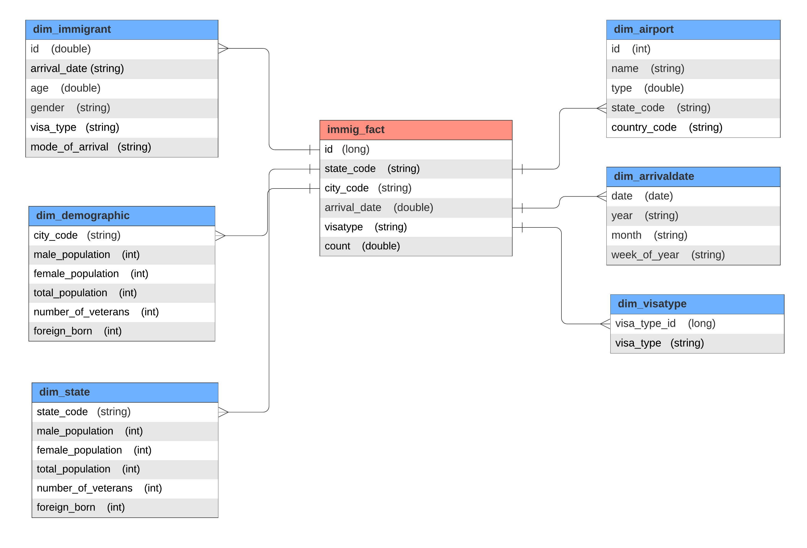

# Immigration analysis - USA

## Scope 

The scope of the project is to get insights and analytics for immigration, airports, and demographics data. The end solution is a data model with star schema with a fact table and five dimension tables which connects immigration data, demographics data, airport data, visa type data and the arrival dates of the immigrants.

With this we can get analysis such as total immigrants using different visa types, total arrivals in different us cities and states, total airports in different US states and much more

We use Spark to load and process the data into dataframes. We explore the data initially and then clean the data from null / missing values.

We create staging tables and then with the help of those tables we create the end fact and dimension tables. Each dimension table and the fact tables are finally checked for data quality by verifying whether the data is present or not. Each of the end table's results are parquet into for deeper understanding and clarity.

#### Describe and Gather Data 
1. *I94 Immigration Data:* This data comes from the US National Tourism and Trade Office.
2. *U.S. City Demographic Data:* This data comes from OpenSoft.This dataset contains information about the demographics of all US cities and census-designated places with a population greater or equal to 65,000. This data comes from the US Census Bureau's 2015 American Community Survey.
3. *Airport Code Table:* This is a simple table of airport codes and corresponding cities.

## ETL steps

#### The function *process_demographic* does the following:
* read the input demographics data
* clean the dataframe from missing values with *clean_data* function
* creates a unique monotonically increasing id for each record
* convert city names to city codes using the *processed_codes* function
* create immigration staging table **staging_demographic**

#### The function *process_immigration* does the following:
* read the input immigration data
* clean the dataframe from missing values with *clean_data* function
* convert the arrival date from sas to pythonic readable date format using *process_dates* function
* filter out data for US only states
* create immigration staging table **staging_immigration**

#### The function *process_airports* does the following:
* read the input airports data
* clean the dataframe from missing values with *clean_data* function
* filter out airports located only in the US
* remove the prefix from region to get well formated state code
* create airports staging table **staging_airports**

#### The function *process_visatype* does the following:
* get the distinct visa type data from immigration dataframe
* creates a unique monotonically increasing id for each record
* create visa types staging table **staging_visatype**

## Data Model
### Conceptual Data Model
#### Staging Tables:
    1. staging_immigration
    2. staging_airports
    3. staging_demographic
    4. staging_visatype

### ERD

#### Dimension Tables:
    1. dim_immigrant
    2. dim_demographic
    3. dim_state
    4. dim_visatype
    5. dim_airport
    6. dim_arrivaldate

#### Fact Table:
    1. immig_fact
    

#### the proposed data model of star schema
Star schemas are easy for end users and applications to understand and navigate. With a well-designed schema, users can quickly analyze large, multidimensional data sets. The main advantages of star schemas in a decision-support environment are:

    * Query performance
    * Load performance and administration
    * Built-in referential integrity
    * Easily understood

## Steps used in this Data Pipeline
The steps necessary to pipeline the data into the chosen data model

1. **Data clansing:** remove nulls, duplicates from the data
2. **Process data:** filter out unwanted columns and process data such as changing datatype format, get distinct values, narrow down to single country etc
3. **Create Staging tables**: Create immigration, demographic, airports and visatype staging tables
4. **Create Dimension tables:** Create immigrant, demographic, state, airports, visatype and arrivaldate dimension tables
5. **Create Fact table:** Create immigration fact table
6. **Save the final result in parquet**

## Data dictionary 

### Dimension table:

1. **dim_immigrant:**
    * **id:** unique id for the immigrants
    * **arrival_date:** date of the immigrant's arrival
    * **gender:** gender of the immigrant
    * **age:** age of the immigrant
    * **visa_type:** visa type given to the immigrant
    * **mode_of_arrival:** mode of arrival by the immigrant into the US
    
2. **dim_demographic:**
    * **city_code:** code of the city
    * **male_population:** total male population in the city
    * **female_population:** total female population in the city
    * **total_population:** total population in the city
    * **number_of_veterans:** total number of veterans in the city
    * **foreign_born:** number of people born outside US in the city
    
2. **dim_state:**
    * **state_code:** code of the state where city belongs
    * **male_population:** total male population in the city
    * **female_population:** total female population in the city
    * **total_population:** total population in the city
    * **number_of_veterans:** total number of veterans in the city
    * **foreign_born:** number of people born outside US in the city
    
3. **dim_airport:**
    * **id:** code for the airport
    * **name:** name of the airport
    * **type:** type of the airport
    * **elevation_ft:** elevation in feets of the airport
    * **state_code:** code of the state where the airport is located
    * **country_code:** code of the country where the airport is located

4. **dim_visatype:**
    * **visa_type_id:** id for the visa type
    * **visa_type:** type of visa

5. **dim_arrivaldate:**
    * **date:** arrival date of the immigrant
    * **year:** year of arrival
    * **month:** month of arrival
    * **day:** day of arrival
    * **week:** week number of a year of arrival

### Fact Table:
1. **immig_fact:**
    * **id:** unique record id of the immgration
    * **state_code:** code of the state where city belongs
    * **city_code:** code of the city**
    * **arrival_Date:** arrival date of the immigrant
    * **visa_type:** type of visa
    * **count:** count of immigrant